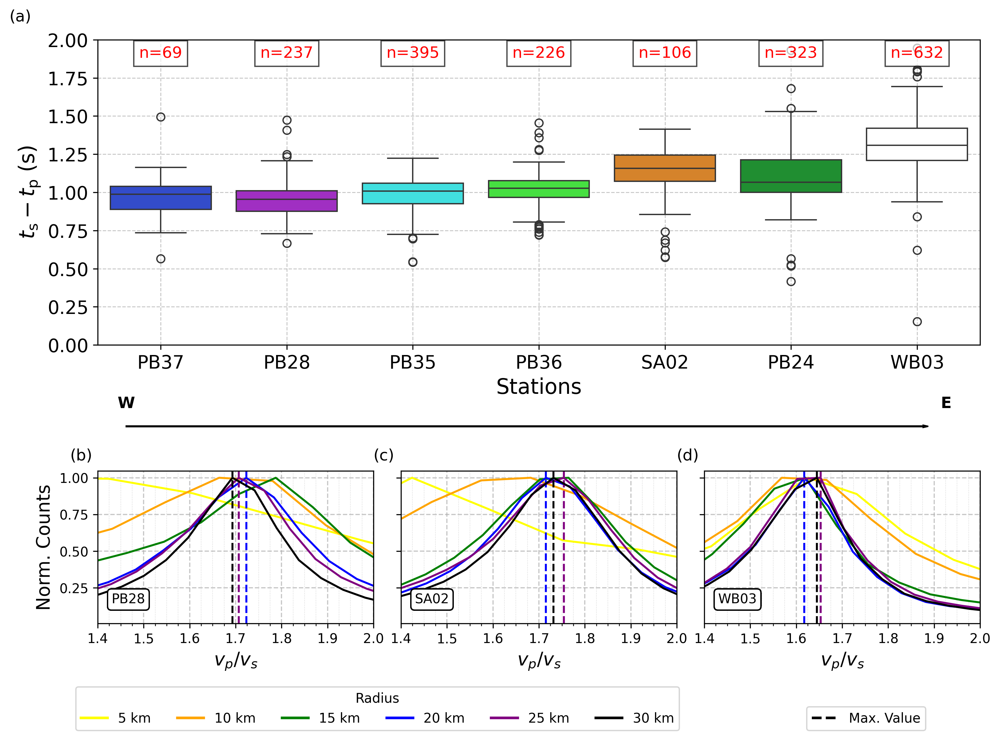

# CMEZ_SPDepthRelocation
Earthquake Depth Relocation using S-P Method in Culberson Mentone Earthquake Zone (CMEZ), Delaware Texas 

# Data

| Data | OneDrive |
|---|---|
|All| |

# Paper

Here:

# Figures

**Figure 1**
  

**Figure 2**
  

**Figure 3**
  

**Figure 4**
 

**Figure 5**
 

**Figure 6**
 

**Figure 7**

**Video**
[Download Video](paper/animation.zip) 

