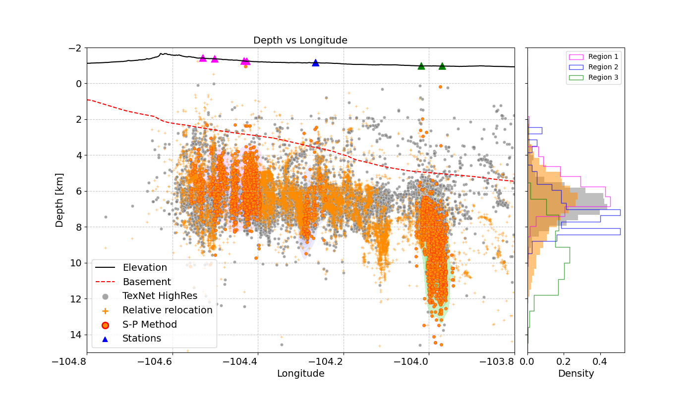
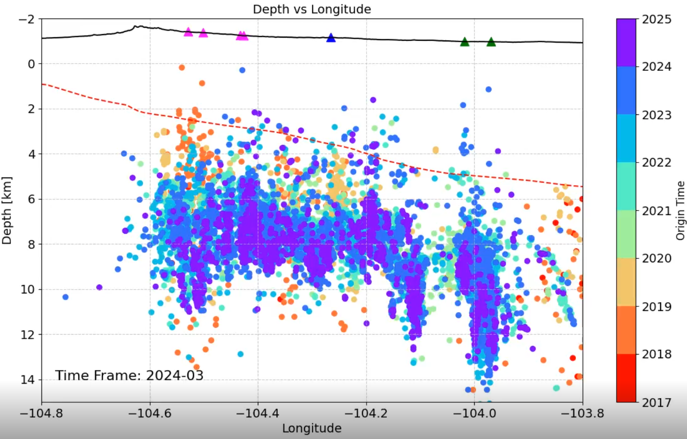
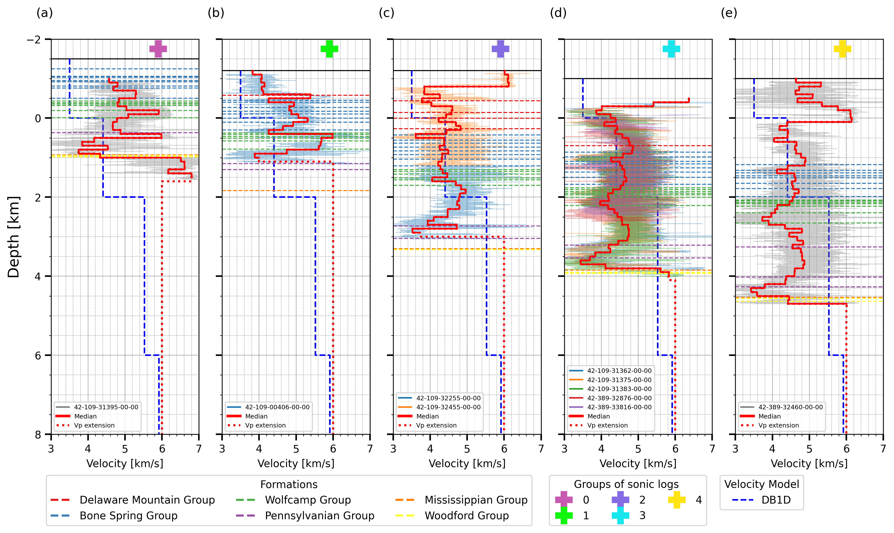

# SP High Resolution Catalog in Culberson Mentone Earthquake Zone (CMEZ), Delaware Texas 

Earthquake Depth Relocation using S-P Method in Culberson Mentone Earthquake Zone (CMEZ), Delaware, Texas 

   

# Data

**All data is saved here**:  

Feel free to use the **Python Scripts** located in **Paper section** to recreate the figures of the paper.

You can also download your specific data in the following sections:

## Catalogs

| | SPHighRes | HighRes | Stations | Video Animation |
|---|---|---|---|---|
|Data| |  |  |  |

## Others
| | Basement | Elevation | ts_tp | Vp | Vp/Vs |
|---|---|---|---|---|---|
|Data| | |  |  |  |

# Paper

Here:

# Figures

**Figure 1**
  

**Figure 2**
  

**Figure 3**
  

**Figure 4**
 

**Figure 5**
 

**Figure 6**
 

**Figure 7**

**Video**

